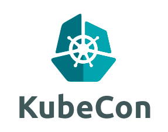

A small wrap up of KubeCon 2017
===============================

{ width=50% }

This is a list of presentations I have seen or would have liked to see at KubeCon.  
Any question can be addressed to <nicolas.borboen@epfl.ch>.

General informations
--------------------
  * Main site: [kubecon.io](https://kubecon.io) (<https://events.linuxfoundation.org/events/cloudnativecon-and-kubecon-europe>)
  * Schedule: <https://events.linuxfoundation.org/events/cloudnativecon-and-kubecon-europe/program/schedule>
  * YouTube playlist: <https://www.youtube.com/playlist?list=PLj6h78yzYM2PAavlbv0iZkod4IVh_iGqV>

Main topics
-----------
  * Cloud Native Computing Foundation (<http://cncf.io/>)
    * <https://kubernetes.io/>
    * <https://prometheus.io/>
    * <http://opentracing.io/>
    * <http://fluentd.io/>
    * <https://linkerd.io/>
    * <http://grpc.io/>
    * <https://coredns.io/>
    * <http://containerd.io/>
    * <https://github.com/coreos/rkt>

TD;DR
-----
If I had to select a few conferences, that would be:

  1. Roadmap and features of K8S 1.6 by Aparna Sinha: <https://youtu.be/GI__pzZXGkU>
  1. Storage Cluster with K8S by Bassam Tabbara: <https://youtu.be/YUMiATM_C6Y>
  1. Building for Trust: How to Secure Your Kubernetes Cluster by Alexander Mohr & Jess Frazelle: <https://youtu.be/QaTAW5ukGME>
  1. Broker API and the K8S Service Catalog by Paul Morie: <https://youtu.be/nYYYWi6nnLs>
  1. Delve into Helm by Lachlan Evenson & Adam Reese: <https://youtu.be/QWBZTWEsgLU>

Wednesday, March 29
-------------------

  * Keynote: Opening Remarks - Dan Kohn, Executive Director, Cloud Native Computing Foundation
    - <http://sched.co/9TeY>
    - <https://youtu.be/3Id76xytyN4?list=PLj6h78yzYM2PAavlbv0iZkod4IVh_iGqV>

  * Introduction to Containerd - Patrick Chanezon, Member of Technical Staff, Docker, Inc.
    - <http://sched.co/ADlF>
    - <https://youtu.be/r2aQmxuEfoE?list=PLj6h78yzYM2PAavlbv0iZkod4IVh_iGqV>

  * Introduction to rkt - Brandon Philips, CTO, CoreOS
    - <http://sched.co/ADlG>
    - <https://youtu.be/ET7h1pM2RBY?list=PLj6h78yzYM2PAavlbv0iZkod4IVh_iGqV>

  * Keynote: Kubernetes 1.6 and the Open Source Roadmap - Aparna Sinha, Product Management Team Lead, Google
    - <http://sched.co/9TdL>
    - <https://youtu.be/GI__pzZXGkU?list=PLj6h78yzYM2PAavlbv0iZkod4IVh_iGqV>

  * Keynote: Red Hat is Driving Kubernetes/Container Security Forward - Clayton Coleman, Architect & Engineer, Cloud Orchestration and Containers, Red Hat
    - <http://sched.co/9TeZ>
    - <https://youtu.be/etBCNy3LFbM?list=PLj6h78yzYM2PAavlbv0iZkod4IVh_iGqV>

  * Keynote: Building the Infrastructure that Powers the Future of AI - Vicki Cheung, Member of Technical Staff & Jonas Schneider, Member of Technical Staff, OpenAI
    - <http://sched.co/9TdN>
    - <https://youtu.be/hPckJmWvZcs?list=PLj6h78yzYM2PAavlbv0iZkod4IVh_iGqV>

  * Keynote: Around the (Cloud Native) World in 323 Days - Andy Randall, CEO, Tigera
    - <http://sched.co/9Teb>
    - <https://youtu.be/q2q43QjCb0g?list=PLj6h78yzYM2PAavlbv0iZkod4IVh_iGqV>

  * Keynote: Prometheus: From Berlin to Bonanza - Brian Brazil, CEO, Robust Perception
    - <http://sched.co/9l57>
    - <https://youtu.be/x2Lp8nktLjE?list=PLj6h78yzYM2PAavlbv0iZkod4IVh_iGqV>

  * (NA) gRPC: What is the Project About and Where Are We Going? - Jayant Kolhe & Varun Talwar, Google
    - <http://sched.co/9rK3>
    - <https://youtu.be/nI1N2pBflao?list=PLj6h78yzYM2PAavlbv0iZkod4IVh_iGqV>

  * (NA) KubeVirt - Kubernetes, Virtualization and Your Future Data Center [I] - Itamar Heim & Fabian Deutsch, Red Hat
    - <http://sched.co/9Tcp>
    - <https://youtu.be/tkhMGLKl5Vw?list=PLj6h78yzYM2PAavlbv0iZkod4IVh_iGqV>

  * (NA) 50 Shades of System Calls [I] - Jorge Salamero Sanz, Sysdig
    - <http://sched.co/9TcF>
    - <https://youtu.be/nSKWGwl29zk?list=PLj6h78yzYM2PAavlbv0iZkod4IVh_iGqV>

  * Alertmanager on Its Way to High Availability [A] - Frederic Branczyk, CoreOS
    - <http://sched.co/9Tc2>
    - <https://youtu.be/oYnKx28MYx4?list=PLj6h78yzYM2PAavlbv0iZkod4IVh_iGqV>

  * (NA) gRPC: Hands-on Building and Debugging Services - Jakob Buchgraber & Jan Tattermusch, Google
    - <http://sched.co/9rKW>

  * The Open Service Broker API and the Kubernetes Service Catalog [B] - Paul Morie, Red Hat & Chip Childers, Cloud Foundry Foundation
    - <http://sched.co/9TcX>
    - <https://youtu.be/nYYYWi6nnLs?list=PLj6h78yzYM2PAavlbv0iZkod4IVh_iGqV>

  * Autoscaling in Kubernetes [I] - Marcin Wielgus, Google
    - <http://sched.co/9Tcr>
    - <https://youtu.be/W0FqbSaYhPI?list=PLj6h78yzYM2PAavlbv0iZkod4IVh_iGqV>

  * How Google Cloud Hosts and Manages Kubernetes at Scale [I] - David Aronchick, Google
    - <http://sched.co/9TcV>
    - <https://youtu.be/yIYxJY_prD4?list=PLj6h78yzYM2PAavlbv0iZkod4IVh_iGqV>

  * Dance Madly on the Lip of a Volcano with Security Release Processes [I] - Jess Frazelle, Google & Brandon Philips, CoreOS
    - <http://sched.co/9TcH>
    - <https://youtu.be/RCqhEwlOnHM?list=PLj6h78yzYM2PAavlbv0iZkod4IVh_iGqV>

  * Building a Storage Cluster with Kubernetes [I] - Bassam Tabbara, Quantum Corp.
    - <http://sched.co/9Tcn>
    - <https://youtu.be/YUMiATM_C6Y?list=PLj6h78yzYM2PAavlbv0iZkod4IVh_iGqV>
    - <https://rook.io>

  * Grafana is Not Enough: DIY User Interfaces for Prometheus [I] - David Kaltschmidt, Weaveworks
    - <http://sched.co/9TcI>
    - <https://youtu.be/OflGpgPJIMo?list=PLj6h78yzYM2PAavlbv0iZkod4IVh_iGqV>

  * Keynote: Backstage with Kubernetes - Chen Goldberg, Director of Engineering, Container Engine & Kubernetes, Google
    - <http://sched.co/9TdM>
    - <https://youtu.be/p1tlwa5e-24?list=PLj6h78yzYM2PAavlbv0iZkod4IVh_iGqV>

  * Keynote: The Kubernetes Application Registry: Easily Deploying Complex Applications with CoreOS Quay - Brandon Philips, CTO, CoreOS
    - <http://sched.co/9Teo>
    - <https://youtu.be/ILH5ieCbP2E?list=PLj6h78yzYM2PAavlbv0iZkod4IVh_iGqV>

  * Keynote: Your Philips Hue Light Bulbs Are Turned On By Kubernetes - Mark van Straten, Senior Software Architect, Q42
    - <http://sched.co/9TdO>
    - <https://youtu.be/3eHk0Oh5NDE?list=PLj6h78yzYM2PAavlbv0iZkod4IVh_iGqV>

  * Keynote: Kubernetes is Still Hard (for Developers) - Michelle Noorali, Software Engineer, Deis
    - <http://sched.co/9TfB>
    - <https://youtu.be/js8wdMpWAgg?list=PLj6h78yzYM2PAavlbv0iZkod4IVh_iGqV>

  * Keynote: Closing Remarks - Kelsey Hightower, Google Cloud Team & CloudNativeCon and KubeCon Conference Co-Chair
    - <http://sched.co/9TfC>

Thursday, March 30
------------------

  * Keynote: What is Cloud Native and Why Should I Care? - Alexis Richardson, CEO of Weaveworks and TOC Chair, CNCF
    - <http://sched.co/9TdK>
    - <https://youtu.be/YYipMcZduRo?list=PLj6h78yzYM2PAavlbv0iZkod4IVh_iGqV>

  * Keynote: Cloud Native in the Enterprise: Production, Best Practice and Innovation - Dr. Ying Xiong, Chief Architect of Cloud Computing, Huawei Technologies
    - <http://sched.co/9Tff>
    - <https://youtu.be/GzcGqBDkufM?list=PLj6h78yzYM2PAavlbv0iZkod4IVh_iGqV>

  * Keynote: Scaling Kubernetes: How do we grow the *Kubernetes* user base by 10x? - Joe Beda, CTO, Heptio
    - <http://sched.co/9TdP>
    - <https://youtu.be/VsKXnt0VvGk?list=PLj6h78yzYM2PAavlbv0iZkod4IVh_iGqV>

  * Keynote: Kubernetes Federation - Kelsey Hightower, Google
    - <http://sched.co/9Tg2>
    - <https://youtu.be/g5IJD0UwBWU?list=PLj6h78yzYM2PAavlbv0iZkod4IVh_iGqV>

  * Building for Trust: How to Secure Your Kubernetes Cluster [I] - Alexander Mohr & Jess Frazelle, Google
    - <http://sched.co/9TcL>
    - <https://youtu.be/QaTAW5ukGME?list=PLj6h78yzYM2PAavlbv0iZkod4IVh_iGqV>

  * (NA) Life of a Packet [I] - Michael Rubin, Google
    - <http://sched.co/9Tcl>
    - <https://youtu.be/vLoZ3AN4d70?list=PLj6h78yzYM2PAavlbv0iZkod4IVh_iGqV>

  * Prometheus: The Unsung Heroes [I] - Alejandro Ramirez, Swisscom Directories AG
    - <http://sched.co/9Tc7>
    - <https://youtu.be/1zbKLz62FG8?list=PLj6h78yzYM2PAavlbv0iZkod4IVh_iGqV>

  * Autoscaling a Multi-Platform Kubernetes Cluster Built with kubeadm [I] - Lucas Käldström, Upper Secondary School Student - Individual Maintainer
    - <http://sched.co/9Tbx>
    - <https://youtu.be/3-vBggNG8tc?list=PLj6h78yzYM2PAavlbv0iZkod4IVh_iGqV>

  * Kubernetes Cluster Federation: How to Write a Federated Controller? [A] - Madhu C.S. & Nikhil Jindal, Google
    - <http://sched.co/9Tcq>
    - <https://youtu.be/9-7O-4un5nc?list=PLj6h78yzYM2PAavlbv0iZkod4IVh_iGqV>

  * Delve into Helm: Advanced DevOps [I] - Lachlan Evenson & Adam Reese, Deis
    - <http://sched.co/9TcY>
    - <https://youtu.be/QWBZTWEsgLU?list=PLj6h78yzYM2PAavlbv0iZkod4IVh_iGqV>

  * (NA) Kubernetes-Defined Monitoring [I] - Gianluca Borello, Sysdig
    - <http://sched.co/9TcE>
    - <https://youtu.be/ls6o7ecz9Qs?list=PLj6h78yzYM2PAavlbv0iZkod4IVh_iGqV>

  * Writing a Custom Controller: Extending the Functionality of Your Cluster [I] - Aaron Levy, CoreOS
    - <http://sched.co/9Tcx>
    - <https://youtu.be/2lidOmXk5DQ?list=PLj6h78yzYM2PAavlbv0iZkod4IVh_iGqV>

  * Scale Kubernetes to Support 50,000 Services [I] - Haibin Xie & Quinton Hoole, Huawei Technologies
    - <http://sched.co/9euN>
    - <https://youtu.be/c7d_kD2eH4w?list=PLj6h78yzYM2PAavlbv0iZkod4IVh_iGqV>

Keywords
--------
  * RBAC ROLE BASED ACCESS CONTROL
    - Using RBAC Authorization: <https://kubernetes.io/docs/admin/authorization/rbac/>

  * Namespaces <https://kubernetes.io/docs/concepts/overview/working-with-objects/namespaces/>

  * RoleBinding  
    `A role binding grants the permissions defined in a role to a user or set of users. It holds a list of subjects (users, groups, or service accounts), and a reference to the role being granted. Permissions can be granted within a namespace with a RoleBinding, or cluster-wide with a ClusterRoleBinding.`

  * Persistent Volumes <https://kubernetes.io/docs/concepts/storage/persistent-volumes/>
    * PV - PersistentVolume  
    `A PersistentVolume (PV) is a piece of networked storage in the cluster that has been provisioned by an administrator. It is a resource in the cluster just like a node is a cluster resource. PVs are volume plugins like Volumes, but have a lifecycle independent of any individual pod that uses the PV. This API object captures the details of the implementation of the storage, be that NFS, iSCSI, or a cloud-provider-specific storage system.`
    * PVC - PersistentVolumeClaim  
    `A PersistentVolumeClaim (PVC) is a request for storage by a user. It is similar to a pod. Pods consume node resources and PVCs consume PV resources. Pods can request specific levels of resources (CPU and Memory). Claims can request specific size and access modes (e.g., can be mounted once read/write or many times read-only).`

  * Dynamic Provisioning and Storage Classes in Kubernetes  
    <http://blog.kubernetes.io/2017/03/dynamic-provisioning-and-storage-classes-kubernetes.html>
    * <https://kubernetes.io/docs/admin/admission-controllers/#defaultstorageclass>

  * PodPreset <https://kubernetes.io/docs/tasks/run-application/podpreset/>  
  `You can use a podpreset object to inject certain information into pods at creation time. This information can include secrets, volumes, volume mounts, and environment variables.`

  * GCP (Google Container OS) <https://cloud.google.com/container-optimized-os/docs/>

  * Kubernetes Operational View - read-only system dashboard for multiple K8s clusters  <https://github.com/hjacobs/kube-ops-view>

  * Rook - Opensource block and object storage (embeded ceph)
    * <https://github.com/rook/rook>
    * <https://rook.io/>

Get PDF
-------
`pandoc KubeCon.md --latex-engine=xelatex --variable urlcolor=cyan -V papersize:a4paper -V geometry:margin=1cm -o 2017_KubeCon.pdf && xpdf 2017_KubeCon.pdf`
